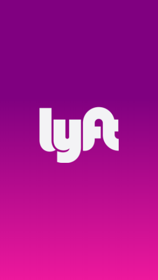
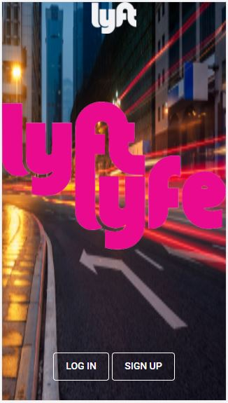
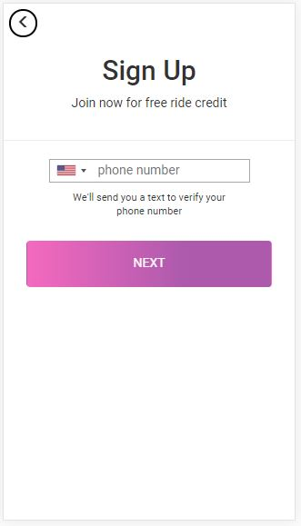
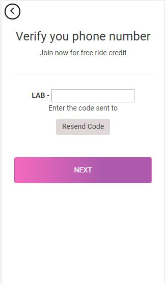
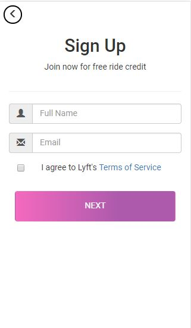
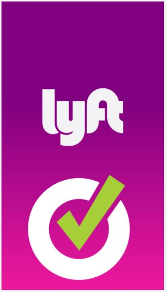

# **LYFT APP**

## **Actualización**

Reparamos los bugs mencionados en la parte original de este _README_: 

* Los botones de _NEXT_ se habilitan y deshabilitan según cumplan o no las condiciones dadas.

* El código de verificación generado y enviado al usuario debe ser el mismo que ingrese en la siguiente vista.

* El usuario tiene ahora la posibilidad de solicitar un nuevo código de verificación totalmente funcional.

Este proyecto se encuentra ahora completo en todas sus funcionalidades.

* Vistas del proyecto: 

>README original:

* En este repositorio presento el reto de código que consiste en crear una app para el portal de servicios de transporte llamado **Lyft**.

* Esta app nos ofrece una vista 'splash' de introducción que dura 2 segundos.

* Sobre la funcionalidad del producto en jquery:

  1. En la vista **signup** se utilizó una librería externa para mostrar el input del número de teléfono con la bandera y el código del país correspondiente. 
  
  2. En esa misma vista, se restringe el uso de carácteres especiales y de letras por medio del atributo 'type'. 

  3. El usuario deberá ingresar un número de teléfono igual o mayor a 10 dígitos. Indicamos esto en el **signup.js**.

  4. El botón de'next' se habilita al cumplirse la condición del número de dígitos y antes de mandar a la siguiente vista emite una alerta indicandole al usuario su número de verificación (generado de manera random).

  5. En la vista **verify** se introduce el número de verificación que debe tener tres dígitos. Al cumplirse esta condición se habilita el botón y nos redirecciona a la siguiente vista.

  6. En la vista **register** se le solicita al usuario que introduzca su nombre completo y su dirección de correo electrónico; de igual manera, se le solicita que 'chekee' la caja de verificación a modo de conformidad con las condiciones del servicio de la app. Cumplidas estas tres condiciones, el botón de 'next' se habilita.

  7. Todas las vistas que lo requieren tienen un botón en la parte superior izquierda para regresar a una vista anterior.

  ###### (_**Bugs superados!**_) Como comentario general debo recalcar que si bien en todas las vistas el botón de 'next' empieza deshabilitado y se logra habilitarlo según las condiciones proporcionadas, aún estoy trabajando en la funcionalidad de **deshabilitarlo** al borrar o cambiar datos en los **inputs**. Al momento del 'deadline' todas las funcionalidades se pueden hacer solamente de la manera en el orden en el que aparecen. (_**Bugs superados!**_)

  
* Estas son las imágenes proporcionadas por el equipo de diseño:

**Desarrollado por _Lucero Hospina_**